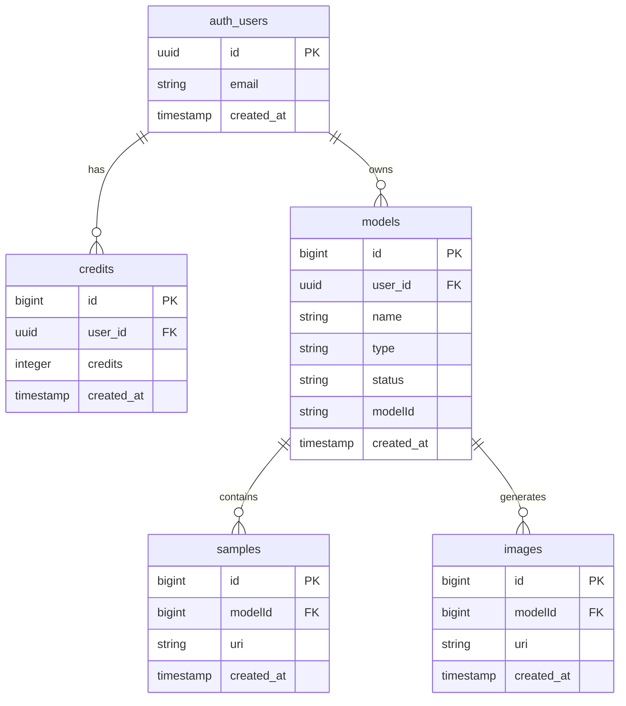

# Design Document

## Overview

This design outlines the recreation of the original Supabase database schema for the headshots application on a new Supabase account. The approach focuses on replicating the exact table structure, relationships, and security policies to ensure seamless compatibility with the existing codebase.

## Architecture

### Database Schema Structure

The database consists of four main tables that support the headshot generation workflow:

1. **credits** - Tracks user credit balances for service usage
2. **models** - Stores information about trained AI models
3. **samples** - Contains training images uploaded by users
4. **images** - Stores generated headshot results

### Data Flow

```
User Authentication (Supabase Auth)
    ↓
Credits Management → Model Training → Sample Upload → Image Generation
    ↓                    ↓               ↓               ↓
credits table       models table    samples table   images table
```

### External Integrations

- **Vercel Blob Storage**: Handles actual file storage for images
- **Replicate API**: Processes model training and image generation
- **Supabase Auth**: Manages user authentication and authorization

## Components and Interfaces

### Database Tables

#### Credits Table
```sql
CREATE TABLE public.credits (
    id bigint PRIMARY KEY GENERATED BY DEFAULT AS IDENTITY,
    created_at timestamp with time zone DEFAULT now() NOT NULL,
    credits integer DEFAULT 0 NOT NULL,
    user_id uuid NOT NULL REFERENCES auth.users(id)
);
```

**Purpose**: Track user credit balances for service usage
**Key Fields**:
- `credits`: Integer count of available credits
- `user_id`: Foreign key to auth.users for ownership

#### Models Table
```sql
CREATE TABLE public.models (
    id bigint PRIMARY KEY GENERATED BY DEFAULT AS IDENTITY,
    name text,
    type text,
    created_at timestamp with time zone DEFAULT now() NOT NULL,
    user_id uuid REFERENCES auth.users(id) ON DELETE CASCADE,
    status text DEFAULT 'processing' NOT NULL,
    modelId text
);
```

**Purpose**: Store information about user-trained AI models
**Key Fields**:
- `status`: Training status (processing, completed, failed, etc.)
- `modelId`: External Replicate model identifier
- `user_id`: Foreign key for ownership and security

#### Samples Table
```sql
CREATE TABLE public.samples (
    id bigint PRIMARY KEY GENERATED BY DEFAULT AS IDENTITY,
    uri text NOT NULL,
    modelId bigint NOT NULL REFERENCES public.models(id) ON DELETE CASCADE,
    created_at timestamp with time zone DEFAULT now() NOT NULL
);
```

**Purpose**: Store references to training images
**Key Fields**:
- `uri`: URL to image stored in Vercel Blob
- `modelId`: Foreign key linking to parent model

#### Images Table
```sql
CREATE TABLE public.images (
    id bigint PRIMARY KEY GENERATED BY DEFAULT AS IDENTITY,
    modelId bigint NOT NULL REFERENCES public.models(id) ON DELETE CASCADE,
    uri text NOT NULL,
    created_at timestamp with time zone DEFAULT now() NOT NULL
);
```

**Purpose**: Store references to generated headshot images
**Key Fields**:
- `uri`: URL to generated image
- `modelId`: Foreign key linking to source model

### Security Model

#### Row Level Security (RLS)
All tables implement RLS to ensure data isolation between users:

1. **User-based Access**: Users can only access records they own
2. **Service Role Access**: Webhooks and background processes use service role for elevated access
3. **Cascade Deletion**: Related records are automatically cleaned up when parent records are deleted

#### Key Security Policies

**Credits Policies**:
- Users can read/update their own credits
- Service role can insert/update any credits (for payment processing)

**Models Policies**:
- Users can CRUD their own models
- Service role can update any model (for webhook status updates)

**Samples/Images Policies**:
- Users can access samples/images through model ownership
- Indirect security through model foreign key relationships

## Data Models

### TypeScript Interfaces

The existing TypeScript interfaces in `types/supabase.ts` define the expected structure:

```typescript
interface Database {
  public: {
    Tables: {
      credits: {
        Row: { id: number; created_at: string; credits: number; user_id: string }
        Insert: { created_at?: string; credits?: number; id?: number; user_id: string }
        Update: { created_at?: string; credits?: number; id?: number; user_id?: string }
      }
      // ... other tables
    }
  }
}
```

### Relationships



## Error Handling

### Database Constraints
- Foreign key constraints ensure referential integrity
- NOT NULL constraints prevent incomplete records
- Default values provide sensible fallbacks

### Application-Level Handling
- Supabase client automatically handles connection errors
- RLS policies provide security error responses
- Cascade deletes prevent orphaned records

### Common Error Scenarios
1. **Insufficient Credits**: Check credits before operations
2. **Model Not Found**: Validate model ownership before access
3. **Training Failures**: Update model status appropriately
4. **File Upload Errors**: Handle Vercel Blob storage failures

## Testing Strategy

### Database Testing
1. **Schema Validation**: Verify table structure matches TypeScript types
2. **Constraint Testing**: Test foreign key and NOT NULL constraints
3. **RLS Policy Testing**: Verify security isolation between users
4. **Performance Testing**: Ensure queries perform adequately

### Integration Testing
1. **API Endpoint Testing**: Verify all database operations work through API
2. **Authentication Testing**: Test user access patterns
3. **Webhook Testing**: Verify service role operations
4. **File Storage Integration**: Test Vercel Blob + database coordination

### Migration Testing
1. **Fresh Database Setup**: Test complete schema creation
2. **Data Migration**: If needed, test data transfer from old account
3. **Application Compatibility**: Verify existing code works unchanged
4. **Environment Variables**: Test new Supabase URL/keys configuration

## Implementation Approach

### Phase 1: Database Setup
1. Create new Supabase project
2. Run schema migration SQL
3. Configure RLS policies
4. Set up proper permissions

### Phase 2: Application Configuration
1. Update environment variables
2. Test database connectivity
3. Verify TypeScript types alignment
4. Test authentication flow

### Phase 3: Validation
1. Test all existing functionality
2. Verify data security
3. Test webhook integrations
4. Performance validation

This design ensures minimal disruption to the existing application while providing a robust, secure database foundation for the headshots service.