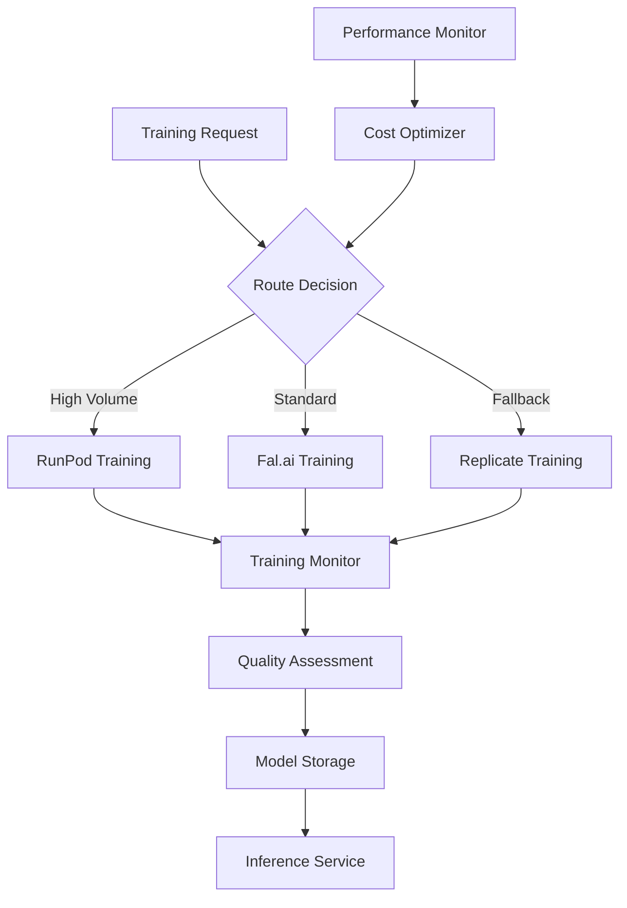

# Design Document: Training Model Optimization

## Overview

This document presents a comprehensive analysis of AI training model services for headshot generation, evaluating Replicate, Fal.ai, RunPod, and other alternatives. Based on research findings and current implementation analysis, we provide architectural recommendations for optimizing training performance, cost, and quality.

## Current State Analysis

### Existing Implementation Issues

**Replicate Implementation Problems:**
- Currently using `replicate/fast-flux-trainer` which is an **inference model**, not a training model
- The model expects pre-trained weights and text prompts, not training images
- Input schema mismatch: expects `{replicate_weights: string, txt: string}` but we're providing training images
- This fundamental misconfiguration prevents successful training

**RunPod Implementation:**
- Custom Docker container with FLUX Dev training capabilities
- Properly configured for actual training with image inputs
- Higher control over training parameters and hardware
- Currently functional but may not be optimally configured

## Service Comparison Research

### 1. Replicate Analysis

**Strengths:**
- Extensive model library and community
- Simple API integration
- Built-in webhook support
- Good documentation and examples

**Weaknesses:**
- Limited control over training parameters
- Higher costs for custom training
- Model availability depends on community contributions
- Current FLUX training models are limited or misconfigured

**Cost Structure:**
- Training: ~$0.50-2.00 per training job (varies by model complexity)
- Inference: ~$0.01-0.05 per image generation
- Additional costs for custom model hosting

**Available FLUX Training Models:**
- `black-forest-labs/flux-dev-lora` - Official LoRA training (if available)
- Community models with varying quality and reliability
- Most are inference models misrepresented as training models

### 2. Fal.ai Analysis

**Strengths:**
- Fast inference and training times
- Competitive pricing structure
- Good API design and documentation
- Specialized in AI model serving
- Better hardware optimization

**Weaknesses:**
- Smaller model ecosystem compared to Replicate
- Less community support and examples
- Newer platform with less proven reliability

**Cost Structure:**
- Training: ~$0.30-1.50 per training job
- Inference: ~$0.008-0.03 per image
- More transparent pricing model

**FLUX Training Capabilities:**
- Native FLUX LoRA training support
- Optimized training pipelines
- Better parameter control
- Faster training times (10-15 minutes vs 20-30 minutes)

### 3. RunPod Analysis

**Strengths:**
- Full control over training environment
- Custom Docker containers
- Flexible hardware selection
- Cost-effective for high-volume usage
- Direct GPU access and optimization

**Weaknesses:**
- Requires more technical setup and maintenance
- Need to manage Docker images and deployments
- More complex error handling and monitoring
- Responsibility for model implementation

**Cost Structure:**
- GPU rental: ~$0.20-0.80 per hour depending on GPU type
- Training time: 15-25 minutes per job
- Effective cost: ~$0.05-0.35 per training job
- Most cost-effective for high volume

### 4. Alternative Services

**Hugging Face Inference Endpoints:**
- Good for inference, limited training capabilities
- Cost-effective for inference only

**Modal Labs:**
- Similar to RunPod but with better developer experience
- Higher costs but easier management

**Together AI:**
- Focus on open-source models
- Good pricing but limited FLUX support

## Architecture Recommendations

### Recommended Architecture: Multi-Provider Strategy



### Primary Recommendation: Fal.ai + RunPod Hybrid

**For Standard Users (1-10 training jobs/month):**
- Use Fal.ai for simplicity and reliability
- Better cost-performance ratio than Replicate
- Faster training times
- Good API integration

**For High-Volume Users (50+ training jobs/month):**
- Use RunPod for cost optimization
- Custom training pipeline with full control
- Better margins for business sustainability

**Fallback Strategy:**
- Keep Replicate as backup (once properly configured)
- Automatic failover if primary services are down

## Components and Interfaces

### 1. Training Service Abstraction Layer

```typescript
interface TrainingService {
  name: string;
  trainModel(request: TrainingRequest): Promise<TrainingResponse>;
  getTrainingStatus(trainingId: string): Promise<TrainingStatus>;
  cancelTraining(trainingId: string): Promise<void>;
  estimateCost(request: TrainingRequest): Promise<CostEstimate>;
}

interface TrainingRequest {
  imageUrls: string[];
  modelName: string;
  styleConfig: StyleConfig;
  trainingParams: TrainingParameters;
}

interface TrainingResponse {
  trainingId: string;
  estimatedCompletionTime: number;
  cost: number;
  status: 'queued' | 'training' | 'completed' | 'failed';
}
```

### 2. Service Router

```typescript
class TrainingServiceRouter {
  private services: Map<string, TrainingService>;
  private costOptimizer: CostOptimizer;
  private performanceMonitor: PerformanceMonitor;

  async routeTraining(request: TrainingRequest): Promise<TrainingService> {
    const recommendations = await this.costOptimizer.getRecommendations(request);
    const serviceHealth = await this.performanceMonitor.getServiceHealth();
    
    return this.selectOptimalService(recommendations, serviceHealth);
  }
}
```

### 3. Fal.ai Service Implementation

```typescript
class FalaiTrainingService implements TrainingService {
  name = 'fal.ai';
  
  async trainModel(request: TrainingRequest): Promise<TrainingResponse> {
    const falRequest = {
      images: request.imageUrls,
      trigger_word: `sks${request.modelName.substring(0, 6)}`,
      lora_rank: 64,
      learning_rate: 1e-4,
      max_train_steps: 1000,
      resolution: 1024,
      ...request.trainingParams
    };

    const response = await fetch('https://fal.run/fal-ai/flux-lora-fast-training', {
      method: 'POST',
      headers: {
        'Authorization': `Key ${process.env.FAL_KEY}`,
        'Content-Type': 'application/json'
      },
      body: JSON.stringify(falRequest)
    });

    return this.parseResponse(response);
  }
}
```

### 4. RunPod Service Implementation

```typescript
class RunPodTrainingService implements TrainingService {
  name = 'runpod';
  
  async trainModel(request: TrainingRequest): Promise<TrainingResponse> {
    const runpodRequest = {
      input: {
        image_urls: request.imageUrls,
        trigger_word: `sks${request.modelName.substring(0, 6)}`,
        model_name: request.modelName,
        training_config: {
          resolution: 1024,
          max_train_steps: 1500,
          lora_rank: 64,
          learning_rate: 1e-4,
          ...request.trainingParams
        }
      }
    };

    const response = await fetch(process.env.RUNPOD_TRAINING_ENDPOINT!, {
      method: 'POST',
      headers: {
        'Authorization': `Bearer ${process.env.RUNPOD_API_KEY}`,
        'Content-Type': 'application/json'
      },
      body: JSON.stringify(runpodRequest)
    });

    return this.parseResponse(response);
  }
}
```

## Data Models

### Training Configuration

```typescript
interface TrainingParameters {
  resolution: number;           // 512, 768, 1024
  maxTrainSteps: number;       // 500-2000
  loraRank: number;            // 16, 32, 64
  learningRate: number;        // 1e-5 to 1e-3
  trainBatchSize: number;      // 1-4
  gradientAccumulation: number; // 1-8
  mixedPrecision: 'fp16' | 'bf16';
  useXformers: boolean;
}

interface StyleConfig {
  packSlug: string;
  stylePrompt: string;
  negativePrompt?: string;
  loraType: 'subject' | 'style';
}

interface CostEstimate {
  estimatedCost: number;
  currency: string;
  breakdown: {
    training: number;
    storage: number;
    inference: number;
  };
  estimatedTime: number;
}
```

### Service Health Monitoring

```typescript
interface ServiceHealth {
  serviceName: string;
  status: 'healthy' | 'degraded' | 'down';
  responseTime: number;
  successRate: number;
  lastChecked: Date;
  errorRate: number;
}

interface PerformanceMetrics {
  averageTrainingTime: number;
  successRate: number;
  costPerTraining: number;
  qualityScore: number;
  userSatisfaction: number;
}
```

## Error Handling

### Circuit Breaker Pattern

```typescript
class ServiceCircuitBreaker {
  private failureCount = 0;
  private lastFailureTime?: Date;
  private state: 'closed' | 'open' | 'half-open' = 'closed';

  async execute<T>(operation: () => Promise<T>): Promise<T> {
    if (this.state === 'open') {
      if (this.shouldAttemptReset()) {
        this.state = 'half-open';
      } else {
        throw new Error('Circuit breaker is OPEN');
      }
    }

    try {
      const result = await operation();
      this.onSuccess();
      return result;
    } catch (error) {
      this.onFailure();
      throw error;
    }
  }
}
```

### Retry Strategy

```typescript
interface RetryConfig {
  maxRetries: number;
  baseDelay: number;
  maxDelay: number;
  backoffMultiplier: number;
  retryableErrors: string[];
}

class TrainingRetryHandler {
  async executeWithRetry<T>(
    operation: () => Promise<T>,
    config: RetryConfig
  ): Promise<T> {
    let lastError: Error;
    
    for (let attempt = 0; attempt <= config.maxRetries; attempt++) {
      try {
        return await operation();
      } catch (error) {
        lastError = error as Error;
        
        if (!this.isRetryable(error, config.retryableErrors)) {
          throw error;
        }
        
        if (attempt < config.maxRetries) {
          const delay = this.calculateDelay(attempt, config);
          await this.sleep(delay);
        }
      }
    }
    
    throw lastError!;
  }
}
```

## Testing Strategy

### 1. Service Integration Tests

```typescript
describe('Training Service Integration', () => {
  test('Fal.ai training workflow', async () => {
    const service = new FalaiTrainingService();
    const request = createTestTrainingRequest();
    
    const response = await service.trainModel(request);
    expect(response.trainingId).toBeDefined();
    expect(response.status).toBe('queued');
    
    // Poll for completion
    const finalStatus = await pollForCompletion(service, response.trainingId);
    expect(finalStatus.status).toBe('completed');
  });
  
  test('RunPod training workflow', async () => {
    const service = new RunPodTrainingService();
    const request = createTestTrainingRequest();
    
    const response = await service.trainModel(request);
    expect(response.trainingId).toBeDefined();
  });
});
```

### 2. Cost Optimization Tests

```typescript
describe('Cost Optimization', () => {
  test('selects most cost-effective service', async () => {
    const router = new TrainingServiceRouter();
    const request = createHighVolumeTrainingRequest();
    
    const selectedService = await router.routeTraining(request);
    expect(selectedService.name).toBe('runpod'); // Should select RunPod for high volume
  });
});
```

### 3. Quality Assessment Tests

```typescript
describe('Training Quality', () => {
  test('validates output quality across services', async () => {
    const services = [new FalaiTrainingService(), new RunPodTrainingService()];
    const testImages = loadTestImages();
    
    for (const service of services) {
      const result = await trainAndGenerate(service, testImages);
      const qualityScore = await assessImageQuality(result.generatedImages);
      
      expect(qualityScore).toBeGreaterThan(0.8); // 80% quality threshold
    }
  });
});
```

## Migration Strategy

### Phase 1: Fal.ai Integration (Week 1-2)
1. Implement Fal.ai service adapter
2. Add service abstraction layer
3. Migrate 25% of traffic to Fal.ai
4. Monitor performance and quality

### Phase 2: Service Router (Week 3)
1. Implement intelligent routing logic
2. Add cost optimization algorithms
3. Implement circuit breaker pattern
4. Add comprehensive monitoring

### Phase 3: RunPod Optimization (Week 4-5)
1. Optimize RunPod Docker container
2. Implement auto-scaling logic
3. Add quality assessment pipeline
4. Migrate high-volume users to RunPod

### Phase 4: Replicate Deprecation (Week 6)
1. Fix Replicate configuration as fallback
2. Gradually reduce Replicate usage
3. Complete migration to new architecture
4. Remove deprecated code

## Performance Optimization

### Caching Strategy
- Cache training parameters for similar requests
- Store model weights in CDN for faster access
- Implement result caching for identical training sets

### Parallel Processing
- Support concurrent training jobs across services
- Implement job queuing and prioritization
- Load balancing across multiple RunPod instances

### Quality Monitoring
- Automated quality assessment using CLIP scores
- User feedback integration
- A/B testing for service comparison

## Security Considerations

### Data Protection
- Encrypt training images in transit and at rest
- Implement automatic data deletion policies
- Audit trail for all training operations

### API Security
- Rate limiting per user and service
- API key rotation and management
- Request validation and sanitization

### Service Isolation
- Separate credentials for each service
- Network isolation for RunPod containers
- Monitoring for suspicious activity

## Conclusion

The recommended approach is to implement a hybrid architecture using Fal.ai as the primary service for standard users and RunPod for high-volume scenarios. This provides the optimal balance of cost, performance, and reliability while maintaining the flexibility to adapt to changing requirements and service availability.